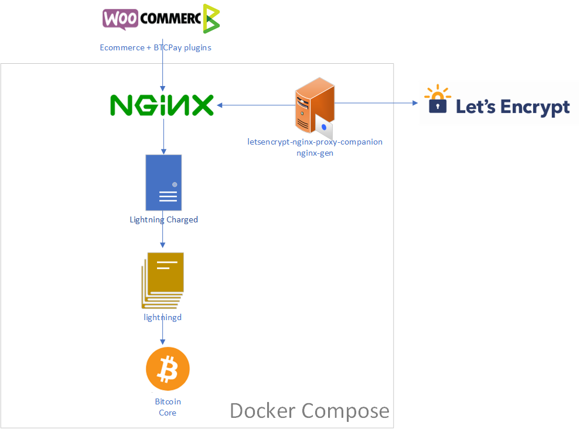

# Lightning Charge Docker-Compose

## Introduction

This repository is meant to have an easy to host docker-compose suitable for production environment of c-lightning.

It is basically a combinaison of:

* LightningD
* Lightning Charged
* Bitcoin Core
* NGINX
* Let's encrypt automatic renewal

The following environment variable are used:

* `NBITCOIN_NETWORK`: the blockchain identifier used by NBitcoin (eg., `regtest`, `testnet`, `mainnet`)
* `CHARGED_HOST`: the external url used to access the NGINX server from internet. This domain name must point to this machine for Let's Encrypt to create your certificate. (typically with a CNAME or A record)
* `LETSENCRYPT_EMAIL`: The email Let's Encrypt will use to notify you about certificate expiration.
* `ACME_CA_URI`: Let's encrypt API endpoint (`https://acme-staging.api.letsencrypt.org/directory` for a staging certificate, `https://acme-v01.api.letsencrypt.org/directory` for a production one)
* `CHARGED_ALIAS`: the lignthning node alias